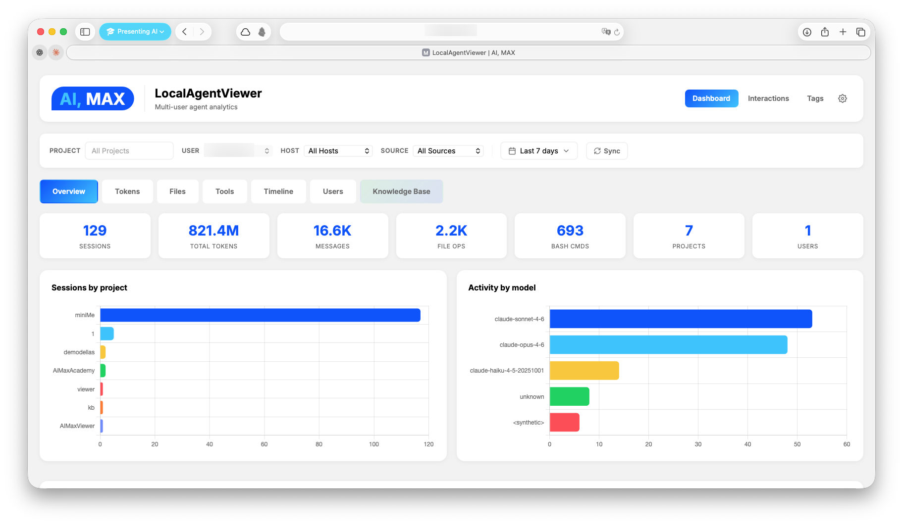
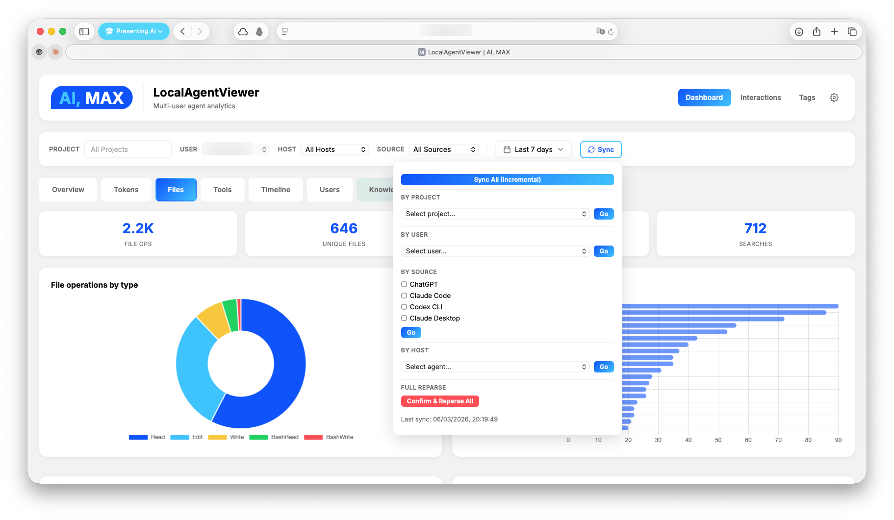
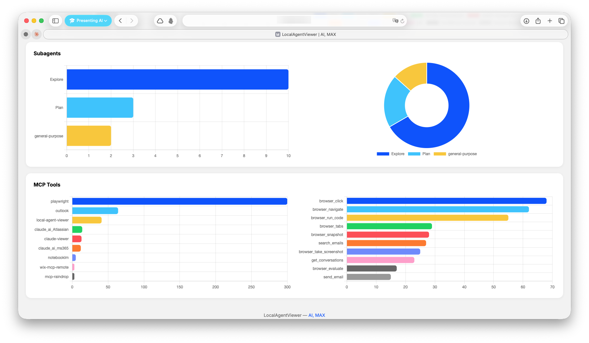
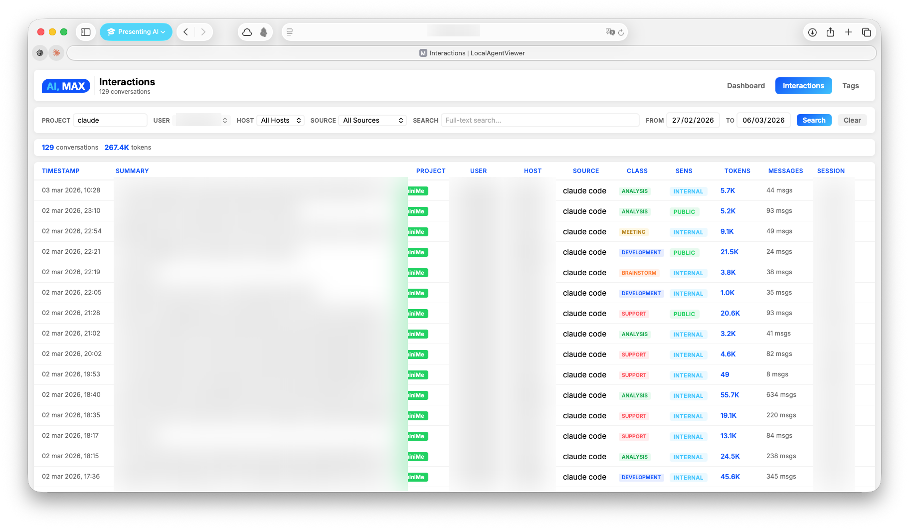

<p align="center">
  <h1 align="center">Local Agent Viewer</h1>
  <p align="center">
    <strong>Your local long-term memory for AI agent interactions.</strong>
    <br />
    Every interaction you have with Claude Code, Codex CLI, Claude Desktop, and ChatGPT — parsed, classified, searchable, and visualized. Across all your machines.
  </p>
</p>

<p align="center">
  <a href="https://github.com/maxturazzini/local-agent-viewer/actions/workflows/ci.yml"></a>
  <a href="LICENSE"></a>
  
  
  
</p>

---

## Want to build your own AI agent?

If LocalAgentViewer sparked your curiosity about AI agents, you might want to go deeper.

**[AI, MAX Academy](https://academy.aimax.it)** offers practical AI training born from 200+ real-world workshops with 2000+ professionals. One of the flagship courses is:

### [Your AI assistant. On your computer.](https://academy.aimax.it/corsi/minime-corso-base/index.html)

A hands-on course that walks you through building a personal AI assistant that works on your own files, knows your work, and stays where it belongs — with you. No cloud dependency, no black boxes. You learn how to think *with* AI, not just how to click buttons.

> The course is currently in **Italian**, but an **English version is on the way**. First lesson is free.

---

## The problem

You talk to AI agents every day. You solve bugs, design systems, refactor codebases, debug deployments. But those interactions vanish into scattered JSONL files buried in `~/.claude/`, `~/.codex/`, and platform-specific directories. No search. No analytics. No memory.

**What if you could remember everything?**

## What LAV does

**LocalAgentViewer** turns your AI agent logs into a persistent, searchable knowledge base — entirely on your machine.

- **Parse** raw JSONL/JSON logs from multiple agents into a single SQLite database
- **Classify** interactions with AI (topics, sensitivity, people, clients, tags)
- **Search** by keyword (FTS5) or by meaning (Qdrant vector search)
- **Visualize** tokens, costs, tools, files, and activity patterns in a real-time dashboard
- **Distribute** across machines — each device parses locally, a central collector unifies everything

No cloud. No accounts. No external dependencies. Just `pip install` and go.

## Supported Agents

| Agent | Source Format | Auto-detected |
|-------|--------------|---------------|
| **Claude Code** | JSONL | `~/.claude/projects/` |
| **Codex CLI** | JSONL | `~/.codex/sessions/` |
| **Claude Desktop (Cowork)** | JSONL | `~/Library/Application Support/Claude/local-agent-mode-sessions/` |
| **ChatGPT** | JSON export | Manual (`conversations.json` from data export) |

## Screenshots

<p align="center">
  
</p>

<details>
<summary><strong>More screenshots</strong></summary>

<p align="center">
  
</p>
<p align="center">
  
</p>
<p align="center">
  
</p>

</details>

## Installation

### 1. Clone and install

```bash
git clone https://github.com/maxturazzini/local-agent-viewer.git
cd local-agent-viewer
pip install -e .
```

This installs the core package (zero external dependencies — stdlib only). All CLI commands become available immediately.

### 2. (Optional) Install extras

```bash
pip install -e ".[classifiers]"   # AI classification (openai)
pip install -e ".[qdrant]"        # Semantic search (qdrant-client, openai, anthropic)
pip install -e ".[mcp]"           # MCP server (fastmcp)
pip install -e ".[all]"           # Everything
```

### 3. (Optional) Configure environment

Copy the example and fill in what you need:

```bash
cp .env.example .env
```

```env
# Only needed for optional features — core works without any of these
OPENAI_API_KEY=sk-...            # AI classification (lav-classify) + embeddings (lav-index)
ANTHROPIC_API_KEY=sk-ant-...     # Qdrant KB auto-tagging via Haiku
QDRANT_URL=http://localhost:6333 # Remote Qdrant server (omit for local file storage)
CHATGPT_EXPORT_PATH=             # Path to ChatGPT conversations.json

# Auth for CLI (lav) and MCP server (lav-mcp)
# LAV_API_KEY=your-secret-key        # Required for write operations (sync, kb index, pricing add)
# LAV_READ_API_KEY=your-read-key     # Optional — if set, read operations require this key

# Classification config (optional — defaults work with OpenAI)
# LAV_CLASSIFY_MODEL=gpt-4.1-mini
# LAV_CLASSIFY_BASE_URL=http://localhost:11434/v1  # Ollama, vLLM, Azure, etc.
# LAV_CLASSIFY_SYSTEM_PROMPT=/path/to/prompt.txt   # or inline text
```

## Quick Start

```bash
# Parse interactions from this machine
lav-parse

# Start the server
lav-server
```

Open **http://localhost:8764** — that's it.

The database is created automatically at `~/.local/share/local-agent-viewer/local_agent_viewer.db`. No configuration required for core functionality.

### CLI Commands

| Command | Description | Requires |
|---------|-------------|----------|
| `lav` | **Unified CLI** — query, search, KB management, sync, pricing | — |
| `lav-parse` | Parse JSONL interactions (Claude Code, Codex, Desktop) | — |
| `lav-parse-chatgpt` | Parse ChatGPT export | `CHATGPT_EXPORT_PATH` |
| `lav-server` | Start the web server | — |
| `lav-classify` | Classify interactions via gpt-4.1-mini | `OPENAI_API_KEY` |
| `lav-index` | Index interactions into Qdrant | `qdrant-client`, `openai` |
| `lav-mcp` | Start MCP server | `fastmcp` |
| `lav-pricing` | Manage model pricing for cost tracking | — |

### Unified CLI (`lav`)

The `lav` command provides direct access to queries, KB management, sync, and pricing — no server or MCP required.

```bash
# Search interactions (SQLite FTS5)
lav search "newsletter pipeline"
lav search "newsletter" --project miniMe --limit 5 --start 2026-03-01

# Show full transcript
lav show <session_id>

# Semantic search (Qdrant KB)
lav kb search "how does the blog publisher work"
lav kb search "debugging MCP" --classification development

# KB management
lav kb status <session_id>
lav kb index <session_id> --tags "blog,newsletter"
lav kb remove <session_id>
lav kb tags <session_id> --set "new,tags"

# Sync & pricing
lav sync
lav sync --scope project --project miniMe --full
lav pricing list
lav pricing add --model gpt-5.4 --input 2.0 --output 8.0 --from-date 2026-04-01
```

**Output formats**: JSON (default, for piping/scripting), `--format table` (human-readable), `--format brief` (one line per result).

**Auth**: write operations (`sync`, `kb index/remove/tags`, `pricing add`) require `LAV_API_KEY` env var. Read operations are open by default, or gated by `LAV_READ_API_KEY` if set.

### Parser options

```bash
lav-parse                        # incremental (default, fast)
lav-parse --project myProject    # parse one project only
lav-parse --full                 # force full reparse

lav-parse-chatgpt               # parse ChatGPT export
lav-parse-chatgpt --full        # full reparse
```

## Data Pipeline

Three layers turn raw agent logs into a searchable, classified knowledge base:

```
JSONL / JSON logs
    │
    ▼
┌─────────────────────────────────────────────────┐
│  1. PARSE → SQLite                              │
│  Raw interactions: sessions, messages, tokens,  │
│  file ops, tool calls, costs, models            │
│  ─ lav-parse / lav-parse-chatgpt                │
└─────────────────┬───────────────────────────────┘
                  │
                  ▼
┌─────────────────────────────────────────────────┐
│  2. CLASSIFY → interaction_metadata (optional)  │
│  AI classification via gpt-4.1-mini:            │
│  summary, topics, people, clients, sensitivity, │
│  process type, tags                             │
│  ─ lav-classify (or auto after sync)            │
└─────────────────┬───────────────────────────────┘
                  │
                  ▼
┌─────────────────────────────────────────────────┐
│  3. INDEX → Qdrant vector DB (optional)         │
│  Semantic embeddings for meaning-based search.  │
│  Reuses SQL metadata when available (no extra   │
│  LLM call). Enables KB search in dashboard.     │
│  ─ lav-index                                    │
└─────────────────────────────────────────────────┘
```

Each layer is independent — the core works with just layer 1. Classification adds structured metadata. Qdrant adds semantic search on top.

## Features

### Analytics Dashboard
- **Overview** — sessions, messages, tokens, costs across time
- **Tokens** — input/output/cache breakdown by model and day
- **Files** — most-modified files, operations heatmap
- **Tools** — tool call frequency and distribution
- **Timeline** — activity patterns and session duration
- **Users** — per-user drill-down with 7 views
- **Knowledge Base** — semantic search across interactions

### 4D Filtering
Every query supports four independent dimensions:

| Dimension | What it filters |
|-----------|----------------|
| **Project** | Which codebase |
| **User** | Which person |
| **Host** | Which machine |
| **Source** | Which agent (claude_code, codex_cli, cowork_desktop, chatgpt) |

### Search
- **Full-text search** via SQLite FTS5 — fast, no external dependencies
- **Semantic search** via Qdrant vector DB (optional, layer 3)
- **Classification filters** — search by topic, sensitivity, process type (layer 2)

### AI Classification (optional)

```bash
# Requires OPENAI_API_KEY in .env
lav-classify              # classify unclassified interactions
lav-classify --full       # reclassify everything
lav-classify --dry-run    # preview
```

Also runs automatically after each sync when `OPENAI_API_KEY` is set.

**Configuration** — all optional, set in `.env`:

| Variable | Default | Description |
|----------|---------|-------------|
| `LAV_CLASSIFY_MODEL` | `gpt-4.1-mini` | Model name (any OpenAI-compatible model) |
| `LAV_CLASSIFY_BASE_URL` | *(OpenAI default)* | API endpoint — e.g. `http://localhost:11434/v1` for Ollama |
| `LAV_CLASSIFY_SYSTEM_PROMPT` | *(built-in)* | Custom system prompt: inline text or path to a `.txt` file |
| `LAV_CLASSIFY_MAX_CHARS` | `12000` | Max chars of interaction text sent to the model |
| `LAV_CLASSIFY_LANGUAGE` | `en` | Language for summary/abstract/process fields (enum fields stay English) |

The `--model` CLI flag overrides `LAV_CLASSIFY_MODEL` for a single run.

> **Note on small models:** The built-in prompt is optimized for small local models (phi4-mini, etc.). Avoid uppercase/NOT-heavy custom prompts — some small models enter degenerate repetition loops. See `tests/evals/` for model comparison reports.

### MCP Server
Expose your analytics to AI tools via the [Model Context Protocol](https://modelcontextprotocol.io). This lets Claude Code, Claude Desktop, or any MCP-compatible client query your interaction history, search the knowledge base, and trigger syncs — all through natural language.

```bash
# Requires: pip install fastmcp
lav-mcp
```

**Available tools:**

| Tool | Auth | Description |
|------|------|-------------|
| `get_interactions` | `LAV_READ_API_KEY` | List/search interactions (FTS, filters by project/user/date) |
| `get_interaction_details` | `LAV_READ_API_KEY` | Full transcript by session ID |
| `semantic_search` | `LAV_READ_API_KEY` | Qdrant vector search with classification/tag/project filters |
| `kb_status` | `LAV_READ_API_KEY` | Check if an interaction is indexed |
| `sync` | `LAV_API_KEY` | Trigger data re-parse (all, by project, or by source) |
| `kb_index` | `LAV_API_KEY` | Index an interaction into Qdrant (auto-tag or pre-metadata) |
| `kb_remove` | `LAV_API_KEY` | Remove an interaction from Qdrant |
| `kb_update_tags` | `LAV_API_KEY` | Update tags without re-embedding |
| `manage_pricing` | `LAV_READ_API_KEY` / `LAV_API_KEY` | List, add, or lookup model pricing |

**Claude Code configuration** (`~/.claude/claude_code_config.json`):
```json
{
  "mcpServers": {
    "local-agent-viewer": {
      "command": "lav-mcp",
      "env": {
        "LAV_API_KEY": "your-write-api-key",
        "LAV_READ_API_KEY": "your-read-api-key"
      }
    }
  }
}
```

Write tools require `LAV_API_KEY`. Read tools require `LAV_READ_API_KEY` if set on the server — if not set, read access is open. Both keys are defined in `.env` and passed to MCP clients via config.

#### Remote MCP server (HTTP transport)

By default `lav-mcp` runs in **stdio** mode (in-process, local clients only). To consume the same tools from a different machine — without ssh-stdio tunnels — switch to the **streamable-http** transport:

```bash
LAV_MCP_TRANSPORT=streamable-http LAV_MCP_PORT=8765 lav-mcp
# Listens on http://127.0.0.1:8765/mcp by default (loopback).
# Set LAV_MCP_HOST=0.0.0.0 to expose on LAN/VPN.
```

| Env var | Default | Purpose |
|---------|---------|---------|
| `LAV_MCP_TRANSPORT` | `stdio` | Set to `streamable-http` to enable the HTTP server |
| `LAV_MCP_HOST` | `127.0.0.1` | Bind address (use `0.0.0.0` for LAN/VPN) |
| `LAV_MCP_PORT` | `8765` | HTTP port |

**Client config** (Claude Desktop / Claude Code) via `mcp-remote`:

```json
{
  "mcpServers": {
    "local-agent-viewer": {
      "command": "npx",
      "args": ["-y", "mcp-remote", "http://<host>:8765/mcp"]
    }
  }
}
```

API keys are passed as tool arguments (field `api_key`), not as HTTP headers — the client reads them from local env and includes them in the MCP request payload.

**Security**: when `LAV_MCP_HOST=0.0.0.0`, always set `LAV_READ_API_KEY` in your `.env` so read access is not open to the network. The transport itself is unencrypted (no TLS) — keep the port behind a VPN or trusted LAN.

For LaunchAgent / systemd templates and installation, see [utils/services/README.md](utils/services/README.md). Full reference: [docs/remote-mcp-server.md](docs/remote-mcp-server.md).

## Multi-Machine Setup

<details>
<summary><strong>Expand for distributed architecture details</strong></summary>

### Architecture

LocalAgentViewer supports a distributed agent/collector model. Each machine parses its own interactions locally. A central collector pulls from all agents into one unified database.

```
                  GET /api/export
┌──────────────┐◄──────────────────┌──────────────┐
│  Collector    │   (pull sessions) │  Agent       │
│  role: both   │                   │  role: agent │
│               │                   │              │
│  Dashboard    │                   │  Parse local │
│  Unified DB   │                   │  Local DB    │
│  All APIs     │                   │  Thin API    │
└──────────────┘                   └──────────────┘
```

### Roles

| Role | Bind | Function |
|------|------|----------|
| **agent** | `0.0.0.0:8764` | Parses local interactions, exposes `/api/export` |
| **both** (default) | `0.0.0.0:8764` | Full server: local parse + pull from agents + dashboard |

### Configuration

Each machine has a **local** config at `~/.local/share/local-agent-viewer/config.json` (not synced via git):

**Collector** (the machine with the dashboard) — see [`config.collector.example.json`](config.collector.example.json):
```json
{
  "role": "both",
  "port": 8764,
  "agents": [
    {
      "name": "laptop",
      "url": "http://laptop.local:8764",
      "fallback_url": "http://10.0.0.5:8764",
      "timeout_seconds": 10
    }
  ]
}
```

**Agent** (each remote machine) — see [`config.agent.example.json`](config.agent.example.json):
```json
{
  "role": "agent",
  "port": 8764,
  "collector_url": "http://collector.local:8764"
}
```

### Data flow

```
Agent machine (every 15 min via LaunchAgent)
  → lav-parse parses local ~/.claude/projects
  → notify_collector() → POST http://collector:8764/api/sync
  → Collector pulls from agent via GET /api/export
  → Canonical DB updated
```

Pull is **on-demand** (triggered by the agent after each parse), not periodic polling.

### Setup

**On the agent:**
```bash
mkdir -p ~/.local/share/local-agent-viewer
cp config.agent.example.json ~/.local/share/local-agent-viewer/config.json
# Edit collector_url to point to your collector machine

lav-parse
lav-server  # or install as a service (see below)
curl http://localhost:8764/api/health
```

**On the collector:**
```bash
mkdir -p ~/.local/share/local-agent-viewer
cp config.collector.example.json ~/.local/share/local-agent-viewer/config.json
# Edit agents list with your remote machines

lav-parse
lav-server
curl -X POST http://localhost:8764/api/sync -H "Content-Type: application/json" -d '{"scope":"all"}'
```

### What lives where

| What | Path | Synced? |
|------|------|---------|
| Code | `local-agent-viewer/` | Yes (git) |
| Runtime config | `~/.local/share/local-agent-viewer/config.json` | No (per-machine) |
| Database | `~/.local/share/local-agent-viewer/local_agent_viewer.db` | No (per-machine) |
| Qdrant data | `~/.local/share/local-agent-viewer/qdrant_data/` | No (per-machine) |

</details>

## Running as a Service (macOS)

<details>
<summary><strong>Expand for LaunchAgent setup</strong></summary>

Run the server and parser automatically on login with auto-restart:

```bash
# Install services
bash utils/services/install.sh

# Activate
launchctl load ~/Library/LaunchAgents/com.aimax.lav-server.plist
launchctl load ~/Library/LaunchAgents/com.aimax.lav-parser.plist

# Verify
launchctl list | grep com.aimax.lav
curl http://localhost:8764/api/health
```

The parser LaunchAgent runs incremental parsing every 15 minutes.

**After code changes:**
```bash
bash utils/services/install.sh
launchctl unload ~/Library/LaunchAgents/com.aimax.lav-server.plist
launchctl load ~/Library/LaunchAgents/com.aimax.lav-server.plist
```

**Logs:** `~/.local/logs/lav-server.log` and `lav-server-err.log`

</details>

## API Reference

<details>
<summary><strong>Expand for full API documentation</strong></summary>

### Universal endpoints (all roles)

| Endpoint | Method | Description |
|----------|--------|-------------|
| `/api/health` | GET | Status, hostname, role, uptime |
| `/api/info` | GET | Sources, session count, DB size |
| `/api/export?since=T&limit=N` | GET | Telemetry package for collector pull |

### Dashboard endpoints (role: both)

| Endpoint | Method | Description |
|----------|--------|-------------|
| `/api/data` | GET | Full analytics with 4D filters |
| `/api/projects` | GET | Project list with stats |
| `/api/users` | GET | User list with stats |
| `/api/user/{username}` | GET | User detail |
| `/api/hosts` | GET | Host list |
| `/api/interactions` | GET | Interaction list (paginated) |
| `/api/interaction/{id}` | GET | Full interaction transcript |
| `/api/search?q=term` | GET | Full-text search |
| `/api/sync` | POST | Trigger sync |
| `/api/sync/status` | GET | Sync progress |
| `/api/classifications/stats` | GET | Classification aggregations |
| `/api/classifications/tagcloud` | GET | Topic/people/client frequencies |
| `/api/interaction/{id}/metadata` | GET | Classification metadata |
| `/api/kb/*` | GET/POST | Qdrant knowledge base |

### Query filters

All dashboard endpoints accept:

```
?project=myProject&user=john&host=laptop&client=claude_code&start=2026-01-01&end=2026-03-01
```

</details>

## Database Schema

<details>
<summary><strong>Expand for schema details</strong></summary>

Single SQLite database with composite primary keys and 4 independent filter dimensions:

| Table | Key | Contents |
|-------|-----|----------|
| `interactions` | `(session_id, project_id)` | Sessions with timestamps, cost, model |
| `messages` | `(session_id, project_id, uuid)` | Individual messages |
| `token_usage` | `(timestamp, session_id, project_id)` | Per-request token counts |
| `file_operations` | `(timestamp, session_id, project_id, tool, file_path)` | File reads/writes |
| `bash_commands` | | Shell commands executed |
| `search_operations` | | Grep/glob operations |
| `skill_invocations` | | Skill usage |
| `subagent_invocations` | | Sub-agent calls |
| `mcp_tool_calls` | | MCP tool invocations |
| `interaction_metadata` | | AI classification results |
| `parse_state` | `(key, project_id, source, host_id)` | Incremental parse cursors |

Reference tables: `projects`, `users`, `hosts`, `session_sources`.

Anti-duplicate on pull: `INSERT OR IGNORE` on composite PKs ensures idempotent ingestion across machines.

</details>

## Project Structure

```
local-agent-viewer/
├── lav/                           # Main package
│   ├── __init__.py
│   ├── cli.py                     # Unified CLI (lav command)
│   ├── config.py                  # Paths, ports, runtime config
│   ├── queries.py                 # SQL queries with 4D filters
│   ├── pricing.py                 # Model pricing management + lav-pricing CLI
│   ├── server.py                  # HTTP server with role-based gating
│   ├── mcp_server.py              # FastMCP server for AI tool integration
│   ├── parsers/
│   │   ├── jsonl.py               # JSONL parser (Claude Code, Codex, Desktop)
│   │   └── chatgpt.py             # ChatGPT export parser
│   ├── classifiers/
│   │   ├── openai_classifier.py   # OpenAI Structured Outputs classifier
│   │   └── sql_classifier.py      # Batch CLI classifier (gpt-4.1-mini)
│   ├── qdrant/
│   │   ├── store.py               # Qdrant vector store client
│   │   ├── indexer.py              # Interaction indexer
│   │   └── kb_indexer.py           # CLI indexer (reuses SQL metadata)
│   └── static/                    # Frontend
│       ├── dashboard.html         # Analytics dashboard (Chart.js)
│       ├── interactions.html      # Interaction browser
│       └── tags.html              # Tag cloud + stats
├── scripts/
│   └── migrate.py                 # Migration from claude-parser
├── tests/
│   └── evals/
│       ├── eval_classify.py       # Classification model eval (multi-model comparison)
│       └── results/               # Eval reports (markdown)
├── config.agent.example.json      # Example config for agent machines
├── config.collector.example.json  # Example config for collector machine
├── pyproject.toml                 # Package config + CLI entry points
├── utils/services/                # LaunchAgent plists + install script
└── docs/
    └── CHANGELOG.md
```

## Requirements

- **Python 3.9+** — core functionality uses stdlib only
- **Optional:** `openai` for AI classification
- **Optional:** `qdrant-client` for semantic search
- **Optional:** `fastmcp` for MCP server

## Contributing

Contributions are welcome! Please open an issue first to discuss what you'd like to change.

1. Fork the repository
2. Create your feature branch (`git checkout -b feature/my-feature`)
3. Commit your changes (`git commit -am 'Add my feature'`)
4. Push to the branch (`git push origin feature/my-feature`)
5. Open a Pull Request

## License

[MIT](LICENSE) — Max Turazzini
