# Schema attuale LAV — mappa grafica e valutazione

> Fotografia dello schema **oggi** (da `SCHEMA` in [jsonl.py:53-346](../../lav/parsers/jsonl.py#L53-L346)),
> per decidere cosa tenere e cosa attaccare prima di progettare il super-schema.
> Versione navigabile in browser: [schema-current.html](schema-current.html).
>
> Architettura concordata: **schema nativo LAV** al centro — OTel è *mappabile in
> uscita con viste* e *in ingresso con adapter di import*. Lo schema non deve
> quindi assumere forma OTel: resta ottimizzato per le query reali di LAV.

---

## 1. La forma d'insieme

```
     ┌──────────┐   ┌──────────┐   ┌──────────┐        DIMENSIONI (3 tabelle)
     │  users   │   │  hosts   │   │ projects │        chi / dove / cosa
     └────┬─────┘   └────┬─────┘   └────┬─────┘
          │              │              │
          └──────────────┼──────────────┘
                         │  user_id + host_id + project_id su OGNI tabella dati
                         ▼
   ┌─────────────────────────────────────────────────────────┐
   │  interactions           PK (session_id, project_id)      │  GRAIN 1 · sessione
   │  ├─ session_sources     PK identica → 1:1  ⚠️            │  (la 4ª dimensione
   │  └─ interaction_metadata PK identica → 1:0..1            │   'source' vive qui)
   └─────────────────────────────────────────────────────────┘
                         │
        ┌────────────────┼────────────────────────────┐
        ▼                ▼                            ▼
   ┌─────────┐    ┌─────────────┐        ┌──────────────────────────┐
   │messages │    │ token_usage │        │  6 TABELLE TOOL          │  GRAIN 3
   │ +FTS5   │    │             │        │  file_operations         │  ⚠️ quasi
   └─────────┘    └──────┬──────┘        │  bash_commands           │   identiche
    GRAIN 2              │               │  search_operations       │   fra loro
    messaggio            │ join per      │  skill_invocations       │
                         │ model+data    │  subagent_invocations    │
                         ▼               │  mcp_tool_calls          │
                  ┌──────────────┐       └──────────────────────────┘
                  │ model_pricing│  costo calcolato a query-time ✅
                  └──────────────┘

   parse_state  ── cursori incrementali per (key, project_id, source, host_id)
```

## 2. Diagramma ER

```mermaid
erDiagram
    USERS ||--o{ INTERACTIONS : "user_id"
    HOSTS ||--o{ INTERACTIONS : "host_id"
    PROJECTS ||--o{ INTERACTIONS : "project_id"
    INTERACTIONS ||--|| SESSION_SOURCES : "1:1 stessa PK"
    INTERACTIONS ||--o| INTERACTION_METADATA : "0..1 classificazione"
    INTERACTIONS ||--o{ MESSAGES : "session_id+project_id"
    INTERACTIONS ||--o{ TOKEN_USAGE : "session_id+project_id"
    INTERACTIONS ||--o{ FILE_OPERATIONS : "session_id+project_id"
    INTERACTIONS ||--o{ BASH_COMMANDS : "session_id+project_id"
    INTERACTIONS ||--o{ SEARCH_OPERATIONS : "session_id+project_id"
    INTERACTIONS ||--o{ SKILL_INVOCATIONS : "session_id+project_id"
    INTERACTIONS ||--o{ SUBAGENT_INVOCATIONS : "session_id+project_id"
    INTERACTIONS ||--o{ MCP_TOOL_CALLS : "session_id+project_id"
    MESSAGES ||--o| MESSAGES_FTS : "trigger sync"
    TOKEN_USAGE }o..|| MODEL_PRICING : "join logico model+data"

    USERS {
        int id PK
        string username UK "NOT NULL"
        string first_seen "NOT NULL"
        string last_seen "NOT NULL"
        string meta_json
    }
    HOSTS {
        int id PK
        string hostname UK "NOT NULL"
        string os_type
        string home_dir
        string meta_json
    }
    PROJECTS {
        int id PK
        string name UK "NOT NULL"
        string source_path
        string meta_json
    }
    INTERACTIONS {
        string session_id PK
        int project_id PK "NOT NULL"
        int user_id FK "NOT NULL def 1"
        int host_id FK "NOT NULL def 1"
        string timestamp "NOT NULL - un solo istante"
        string display
        string summary
        string project "ridondante vs projects.name"
        string model
        int total_tokens "aggregato materializzato"
        int message_count "aggregato materializzato"
        string tools_used "JSON"
        string cwd
        string git_branch
        string parent_session_id "albero subagent"
        string agent_id
    }
    SESSION_SOURCES {
        string session_id PK
        int project_id PK
        string source "NOT NULL - 4a dimensione"
        string client_version
        string process_name
        string vm_process_name
        string meta_json
    }
    INTERACTION_METADATA {
        string session_id PK
        int project_id PK
        string summary
        string abstract
        string process
        string classification
        string data_sensitivity
        string topics
        string people
        string clients
        string tags
        string model_used
    }
    MESSAGES {
        int id PK
        string session_id "NOT NULL"
        int project_id "NOT NULL"
        int user_id "NOT NULL def 1"
        int host_id "NOT NULL def 1"
        string uuid UK "parte di UNIQUE"
        string type "NOT NULL - user o assistant"
        string content "raw JSON o testo"
        string timestamp "NULLABLE - incoerenza"
        int tokens_in
        int tokens_out
        string model
        string api_message_id "ponte verso token_usage"
        string agent_id
    }
    TOKEN_USAGE {
        int id PK
        string timestamp "NOT NULL - parte di UNIQUE"
        string session_id "NOT NULL"
        int project_id "NOT NULL"
        int user_id "NOT NULL def 1"
        int host_id "NOT NULL def 1"
        string model
        int input_tokens "def 0"
        int output_tokens "def 0"
        int cache_creation_tokens "def 0"
        int cache_read_tokens "def 0"
        string cwd
        string api_message_id "UNIQUE parziale LAV-39"
    }
    MODEL_PRICING {
        int id PK
        string model UK "NOT NULL"
        string provider
        float input_price_per_mtok "NOT NULL"
        float output_price_per_mtok "NOT NULL"
        float cache_write_price_per_mtok
        float cache_read_price_per_mtok
        string from_date UK "NOT NULL"
        string to_date "NULL = ancora valido"
    }
    FILE_OPERATIONS {
        int id PK
        string timestamp "NOT NULL"
        string tool "NOT NULL"
        string file_path "NOT NULL"
        string cwd
        string git_branch
    }
    BASH_COMMANDS {
        int id PK
        string timestamp "NOT NULL"
        string command "NOT NULL"
        string description
        string target_file
    }
    SEARCH_OPERATIONS {
        int id PK
        string timestamp "NOT NULL"
        string tool "NOT NULL"
        string pattern "NOT NULL"
        string path
        string output_mode
    }
    SKILL_INVOCATIONS {
        int id PK
        string timestamp "NOT NULL"
        string skill_name "NOT NULL"
        string args
    }
    SUBAGENT_INVOCATIONS {
        int id PK
        string timestamp "NOT NULL"
        string subagent_type "NOT NULL"
        string description
        string prompt
        string model
        int run_in_background
    }
    MCP_TOOL_CALLS {
        int id PK
        string timestamp "NOT NULL"
        string tool_name "NOT NULL"
        string server_name
    }
```



*(Le 6 tabelle tool hanno tutte anche `session_id`, `project_id`, `user_id`,
`host_id`, `cwd` — omessi nel diagramma per leggibilità. È esattamente il punto §4.1.)*

---

## 3. Cosa REGGE (da non toccare)

| Scelta | Perché è buona |
|---|---|
| **4 dimensioni su ogni tabella dati** (`project_id`, `user_id`, `host_id` + `source` via session_sources) | Filtri componibili ovunque senza join a cascata. Raro e ben fatto; il super-schema lo eredita tale e quale |
| **PK composita `(session_id, project_id)`** | Permette alla stessa sessione di materializzarsi sotto più progetti — modella un fatto reale, non è un workaround |
| **`model_pricing` con validità temporale + costo a query-time** | Il costo non è mai materializzato: cambi i prezzi e la storia si ricalcola. Da preservare come principio |
| **FTS5 con trigger di sync** | Ricerca full-text senza duplicare lo storage |
| **Append-only + sentinelle esplicite** (`project_id=-1`, `source=''`) | Nessun NULL ambiguo nelle chiavi; `parse_state` è già il modello di riferimento |
| **`parse_state` con `host_id`** | Cursori incrementali per macchina: corretto nel modello distribuito agent/collector |
| **`parent_session_id` + `agent_id`** | L'albero master/subagent c'è già e funziona (roll-up ricorsivo) |

---

## 4. Cosa NON regge — in ordine di gravità

### 4.1 ⚠️ Le 6 tabelle tool sono la stessa tabella scritta sei volte

Tutte condividono **8 colonne identiche** (`id`, `timestamp`, `session_id`,
`project_id`, `user_id`, `host_id`, `cwd`, `git_branch`) e differiscono per 2-4
colonne specifiche. È il pattern *table-per-subtype* senza tabella padre.

Sintomi concreti, già osservabili oggi:

- *"tutti i tool della sessione X in ordine cronologico"* richiede una **UNION a 6 rami**
- aggiungere `tool_call_id` + `duration_ms` + `is_error` (i tre campi che la gap
  analysis indica come must-have) significa **18 `ALTER TABLE`**
- un tipo di tool nuovo = una tabella nuova + parser + query + UI
- **nessun link al messaggio che ha invocato il tool**: la correlazione
  `tool_use.id` esiste nei file, viene letta ([jsonl.py:1140](../../lav/parsers/jsonl.py#L1140)) e scartata

**Due strade** (§6 per la raccomandazione):

- **(A) conservativa** — 18 ALTER TABLE, zero rotture, lo *smell* resta
- **(B) tabella `tool_calls` unica** — colonne comuni + `tool_kind` + `detail_json`
  per le specifiche, e le 6 tabelle attuali ricreate come **VIEW con lo stesso
  nome e le stesse colonne**: query, API e UI esistenti continuano a funzionare
  senza modifiche

### 4.2 ⚠️ `session_sources` è 1:1 con `interactions` ma è una tabella a parte

Stessa identica PK `(session_id, project_id)`. Ogni query che vuole filtrare per
`source` — cioè quasi tutte — paga un join. La 4ª dimensione è l'unica che non
sta sulla riga dei fatti.

Non è un errore grave (la separazione ha un senso storico), ma nel super-schema
`source` andrebbe **denormalizzato su `interactions`** — mantenendo `session_sources`
per i metadati di client (versione, process name, meta_json).

### 4.3 ⚠️ `token_usage.UNIQUE(timestamp, session_id, project_id)` è fragile

Due chiamate API nello stesso millisecondo, nella stessa sessione, **collidono**
e una viene persa silenziosamente. È esattamente il motivo per cui LAV-39 ha
dovuto aggiungere l'indice UNIQUE parziale su `api_message_id`: una toppa su un
vincolo mal scelto. Nel super-schema la chiave naturale è
`(session_id, project_id, api_message_id)` quando c'è, con fallback esplicito.

### 4.4 Le tre tabelle di fatto non sono correlate fra loro

`messages`, `token_usage` e i tool si legano solo per
`(session_id, project_id, timestamp)` — un join per timestamp, fragile per
definizione. L'unico ponte reale è `api_message_id`, e solo per claude_code/cowork.

Manca: `messages` ← `tool_calls` (quale messaggio ha invocato quale tool) e
`messages` ← `token_usage` in modo affidabile per tutte le sorgenti.

### 4.5 Incoerenze minori ma da sanare nel passaggio

| Cosa | Dove | Nota |
|---|---|---|
| `messages.timestamp` **nullable** mentre in tutte le altre tabelle è NOT NULL | messages | Con la regola per-tabella dovrebbe essere NOT NULL — il censimento in corso lo confermerà |
| `interactions.project` (TEXT) duplica `projects.name` | interactions | Denormalizzazione ridondante accanto a `project_id` |
| `interactions.total_tokens` e `message_count` sono **aggregati materializzati** | interactions | In contraddizione col principio "il costo non si materializza mai": possono divergere dai fatti |
| Solo `interaction_metadata` ha la FK verso `interactions` | tutte le altre | Le tabelle di fatto referenziano le dimensioni ma non la sessione |
| `bash_commands` e `mcp_tool_calls` **non hanno UNIQUE** | 2 tabelle su 6 | Duplicati possibili al reparse — infatti LAV-74 ha dovuto fare wipe manuale su queste tabelle |

### 4.6 Manca il grain degli eventi

Nessuna casa per errori, retry, rate limit, compaction, fine turno/run — che la
gap analysis trova presenti in 4 sorgenti su 5. Oggi vengono semplicemente
scartati in fase di parse.

---

## 5. La regola NOT NULL applicata per tabella

Con la tua regola (*la popolazione di quella tabella*, non tutte le sorgenti) i
vincoli diventano molto più forti. Anticipazione da confermare col censimento:

| Tabella | Chi la popola | Candidati NOT NULL grazie alla regola per-tabella |
|---|---|---|
| `interactions` | tutte e 5 | `session_id`, `project_id`, `user_id`, `host_id`, `started_at`, **`source`** (oggi altrove) |
| `messages` | tutte e 5 | + `timestamp` (oggi nullable), `type`/role |
| `token_usage` | claude_code, codex, cowork — **non** chatgpt/claude_ai | `model`, `input_tokens`, `output_tokens` possono essere **NOT NULL**: chi non ha token non scrive righe qui |
| `tool_calls` | tutte e 5 | `tool_name`, `timestamp`; `tool_call_id` NOT NULL solo se ChatGPT (che non ce l'ha) resta escluso o usa sentinella |
| `session_events` (nuova) | claude_code, codex, cowork | `event_type`, `timestamp` |

Il punto §4.1(B) e questa tabella si sostengono a vicenda: una `tool_calls`
unificata permette di dichiarare NOT NULL ciò che oggi, sparso su 6 tabelle con
popolazioni diverse, non si potrebbe.

---

## 6. Cosa attaccare, in che ordine

**Verdetto sullo schema attuale: la spina dorsale è sana, la periferia no.**
Dimensioni, PK composita, pricing e FTS non si toccano. Il debito è concentrato
in tre punti, e conviene aggredirli in quest'ordine perché ognuno abilita il
successivo:

1. **`tool_calls` unificata + 6 view di compatibilità** (§4.1 opzione B).
   È il prerequisito di tutto il lavoro sui tool (`tool_call_id`, durata,
   is_error, link al messaggio) e trasforma 18 ALTER TABLE in una tabella nuova.
   Retrocompatibilità garantita dalle view: nessuna query, API o pagina va toccata.
2. **`source` su `interactions`** + chiave `token_usage` sanata (§4.2, §4.3).
   Due modifiche piccole che tolgono un join dalla stragrande maggioranza delle
   query e chiudono un bug latente di perdita silenziosa.
3. **`session_events`** (§4.6) — la casa per errori/retry/rate-limit/compaction,
   tabella nuova, zero impatto sull'esistente.

Poi, sopra questa base, si aggiungono le colonne segnalate dalla gap analysis
(`stop_reason`, `error_type`, `request_id`, durate, `reasoning_tokens`) e si
definiscono le **viste OTel** in uscita.

**Le tre modifiche sono tutte additive**: nessun DROP, nessuna colonna rimossa,
nessuna PK cambiata su tabelle esistenti. Le view preservano i nomi vecchi.

## 7. Domanda aperta per te

Sul punto 1 la scelta è tra **(A)** 18 ALTER TABLE che lasciano lo schema com'è —
davvero "senza sconvolgere", ma il debito resta e ogni tool nuovo lo aggrava — e
**(B)** `tool_calls` unica con le 6 view omonime, che è più lavoro una volta sola
ma rende dichiarabili i NOT NULL e apre il link tool↔messaggio.

Io consiglio **(B)**: le view rendono il cambiamento invisibile a query, API e UI,
quindi "non sconvolge" nei fatti, e senza quella base i tre campi tool must-have
vanno replicati sei volte. Ma è una scelta di appetito al rischio, e la decidi tu.
